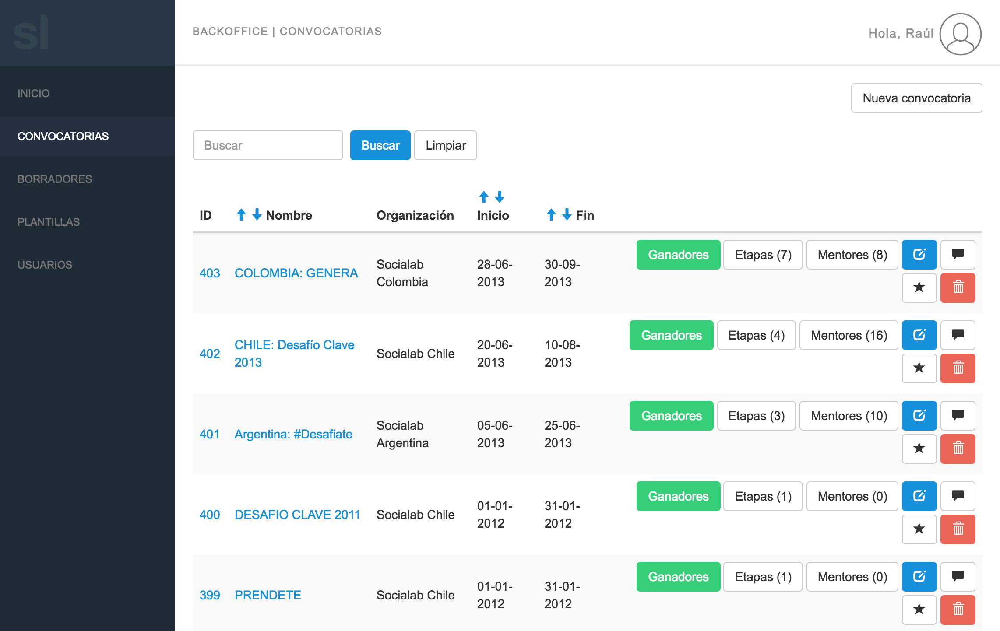
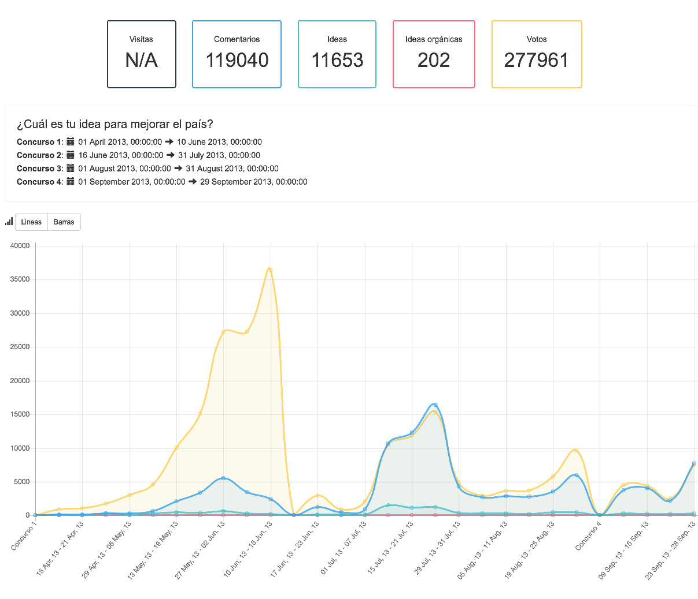

title: Beerjs #17
author:
  name: Raúl Hernández
  twitter: raulghm
  url: https://raulghm.com
  email: raulghm@gmail.com
output: index.html
theme: juanbrujo/cleaver-beerjs
style: style.css
controls: true

--

# Buenas practicas en el desarrollo
## desde Laravel (PHP-MVC)

--

# Un problema común cuando llegas a un proyecto

* Falta de documentación
* Inconsistencia y desorden en los assets (CSS/JS)
* No Dev Guidelines
* No Design Styleguide
* Problemas de usabilidad y experiencia

--

# Ejemplo de App



--

# ¡Es necesario avanzar y seguir desarrollando! (los clientes no esperan)
> Pero muchas veces es costoso y los tiempos exigen practicas paliativas de cierta forma

--

# Workaround
## A veces es necesario tomar otro camino y tomas medidas concretas
> Ojo que debe ser una medida temporal y hay que pensar en un plan progresivo y a largo plazo.

--

# Tareas que pueden servir para salvar el día
## Paso 1

### Definir el piso

* Sanitización de archivos de configuración `.env`
* Tratar de ordenar archivos PHP esenciales (model, controller, view, etc)
* Normalizar `composer.json`
* Tener `.editorconfig` decente
* `.gitignore` (obvio)
* Usar `.jscsrc` (recomiendo el preset de Airbnb)
* Ordenar cada archivo CSS y JS
* Usar un package manager como Bower o NPM (prefiero el ultimo)

--

## Paso 2

### Componentización de logica

* Elegir un framework como **VueJS** para jugar con los componentes y encapsular la lógica
* Una buena metodología CSS `SASS -> BEM -> SuitCSS`
* Browserify al rescate

--

## Paso 3

### Usar la navaja suiza de Laravel
* Elixir (para automatizar tareas front con Gulp)
* Artisan (CLI que ayuda a ejecutar tareas del core de Laravel)

--

# Archivo `gulpfile.js` de ejemplo

```
var elixir = require('laravel-elixir');

var gulp = require('gulp');
var extend = require('merge');
var sftp = require('gulp-sftp');
elixir.config.sourcemaps = false

/**
 * Assets deployment (FTP)
 */
var ftpAuth = require('./deploy-credentials.json');

/**
 * Upload dist files via FTP
 */
gulp.task('ftp', function() {
  return gulp.src('public/build/**/*')
    .pipe(sftp(ftpAuth))
});

/**
 * Purge CDN cache
 */
gulp.task('cdn', function() {
 var request = require('request');
 var url = 'https://URL_END_POINT';
 var body = {'files': [
   'http://cdn.URL.com/FILE',
 ]};
 request({
    url: url,
    method: 'POST',
    json: true,
    headers: {
     'content-type': 'application/json',
    },
    body: body
 }, function(error, resp, body) {
   if (!error && resp.statusCode === 200) {
     $.util.log(body);
   }
 });
});

elixir(function(mix) {
  /**
   * Styles SASS
   */
  mix.sass([
    'app.scss'
  ], 'public/css');

  /**
   * Browserify
   */
  mix.browserify('app.js');

  /**
   * Copy vendors
   */
  mix.copy('resources/assets/js/vendor/html5shiv.min.js', 'public/js/vendor/html5shiv.min.js');
  mix.copy('resources/assets/js/vendor/jquery.min.js', 'public/js/vendor/jquery.min.js');
  mix.copy('resources/assets/js/vendor/modernizr.min.js', 'public/js/vendor/modernizr.min.js');
  mix.copy('resources/assets/js/vendor/respond.min.js', 'public/js/vendor/respond.min.js');
  mix.copy('resources/assets/js/vendor/selectivizr-min.js', 'public/js/vendor/selectivizr-min.js');

  /**
   * Production mode
   */
  if (elixir.config.production) {
    mix.version([
      'css/app.css',
      'js/app-vendor.js',
      'js/app.js',
    ]);
  }

  mix.copy('public/fonts/**/*', 'public/build/fonts');
});


```

--

# Ejemplo de componente VueJS

## Vista HTML
``` html
<div v-if="chart.type=='line'">
      <graph
        :type="'line'"
        :labels="{{ json_encode($data['etapas_labels']) }}"
        :values="[
                  {
                    label: {{ json_encode(trans('forms.visits')) }},
                    data: {{ json_encode($data['data_visitas']) }},
                    borderColor: 'rgba(42, 55, 71, 0.8)',
                    backgroundColor: 'rgba(42, 55, 71, 0.1)'
                  },
                  {
                    label: {{ json_encode(trans('forms.comments')) }},
                    data: {{ json_encode($data['data_comentarios']) }},
                    borderColor: 'rgba(54, 162, 235, 0.8)',
                    backgroundColor: 'rgba(54, 162, 235, 0.1)'
                  },
                  {
                    label: {{ json_encode(trans('forms.ideas')) }},
                    data: {{ json_encode($data['data_ideas']) }},
                    borderColor: 'rgba(75, 192, 192, 0.8)',
                    backgroundColor: 'rgba(75, 192, 192, 0.1)'
                  },
                  {
                    label: {{ json_encode(trans('forms.organics_ideas')) }},
                    data: {{ json_encode($data['data_ideas_org']) }},
                    borderColor: 'rgba(253, 101, 133, 0.8)',
                    backgroundColor: 'rgba(253, 101, 133, 0.1)'
                  },
                  {
                    label: {{ json_encode(trans('forms.votes')) }},
                    data: {{ json_encode($data['data_votos']) }},
                    borderColor: 'rgba(255, 206, 86, 0.8)',
                    backgroundColor: 'rgba(255, 206, 86, 0.1)'
                  },
                ]"
      ></graph>
    </div>
```

## Graph.js
``` js
import Chart from 'chart.js';

export default {
  template: '<canvas v-el:chart></canvas>',
  props: [
    'type',
    'labels',
    'values',
  ],
  ready() {
    new Chart(this.$els.chart.getContext('2d'), {
      type: this.type,
      data: {
        labels: this.labels,
        datasets: this.values,
      },
      options: {
        legend: {
          display: false
        }
      }
    });
  }
}

```

--

# Componente en VueJS para generar graficos dinámicos



--

# Beneficios de usar componentes con VueJS

* Buena documentación en https://laracasts.com
* Buen soporte de la comunidad
* Fácil integración con Browserify y Elixir
* Tambien se puede integrar facilmente con Webpack
* Bootstrapping fácil y configuración minimalista

--

# Resultados de buenas practicas a corto plazo

* Reducción de problemas de consistencia importantes en el código
* Normalización y uso eficiente del tiempo de desarrollo
* Menos estres y mejora de la salud mental :)

--

# Enlaces útiles

* https://laracasts.com
* https://vuejs.org
* https://laravel.com/docs/5.3/elixir
